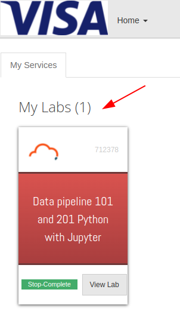
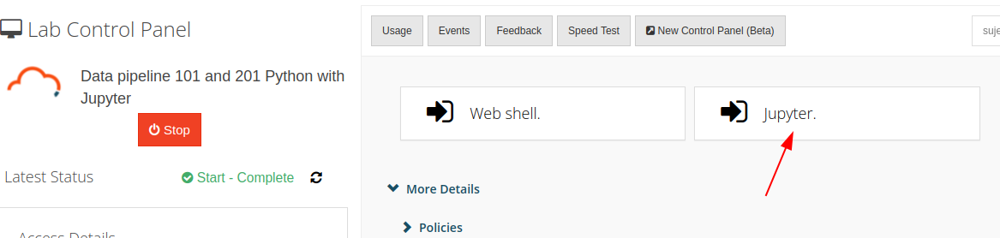
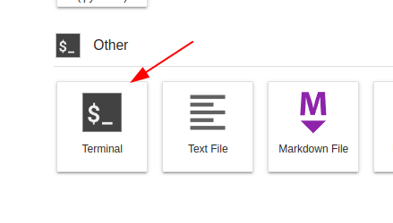
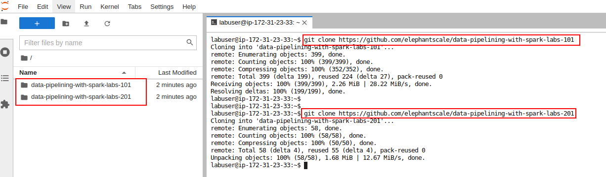

<link rel='stylesheet' href='../assets/css/main.css'/>

# Nuvepro Setup

Here is the guide to setup the labs on Nuvepro lab environment.

## Step-1: Login to Nuvepro account


Use the login credentials will be provided

## Step-2: Dashboard

You will see the dashboard with lab VM



## Step-3: Start the VM


## Step-4: Access Jupyter



## Step-5: Launch Terminal



## Step-6: Download the labs

In terminal, download the labs as follows

```bash
$   git clone https://github.com/elephantscale/data-pipelining-with-spark-labs-101

$   git clone https://github.com/elephantscale/data-pipelining-with-spark-labs-201
```



## Setup is done!
