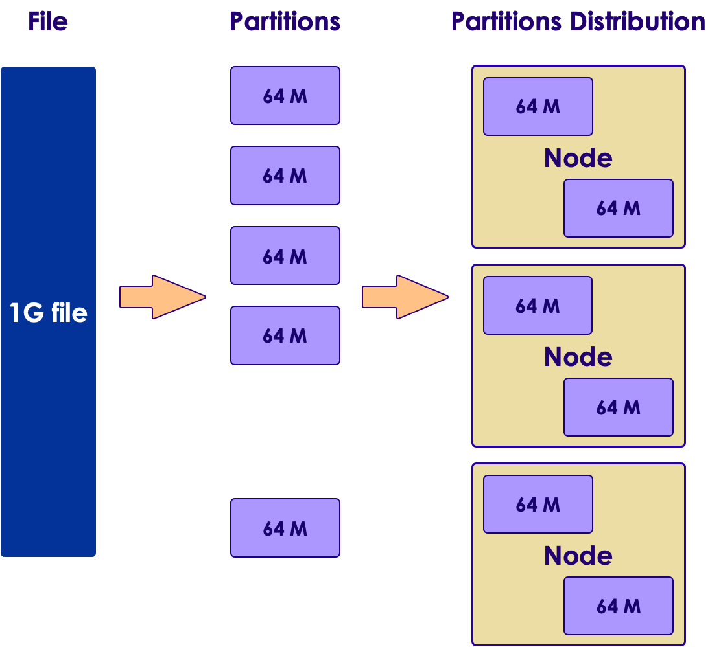
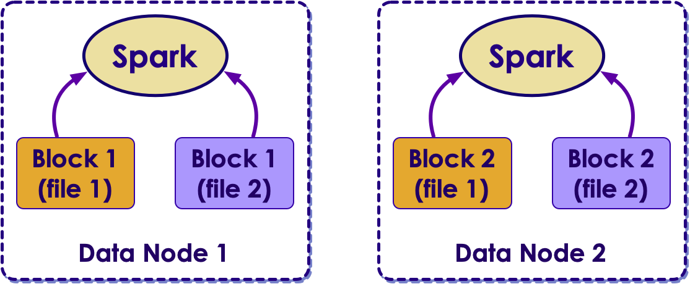
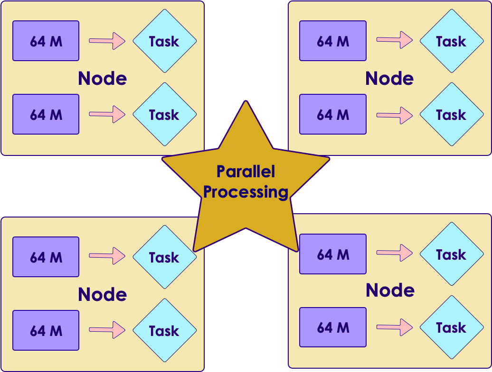

<link rel='stylesheet' href='../assets/css/main.css'/>

# Spark and HDFS Labs

## Spark and HDFS

HDFS chops files into partitions and these partitions are distributed across the cluster

Spark works well with HDFS.  Spark can understand file layout and prioritize local data.

Spark will spin up a task per partition to process data.  This way, we get parallelism

## Lab-5.1: Accessing HDFS files from Spark

This is a quick lab we will access data on HDFS from Spark

[Lab instructions](5-1_accesssing-hdfs-files.md)

## Lab-5.2: Generating data

* In this lab, you will use a **data generator script** to create some sample data.
* We can configure partition size for the generated data
* We will generate various partition sizes (small to large)

[Lab instructions](5-2_generate-data.md)

## Lab-5.3: Partition size vs processing times

* In this lab, we will run Spark jobs on data of various partition sizes and compare the results

[Lab instructions](5-3_partition-size-and-processing.md)

## Lab-5.4: Merging small files into large files

* In this lab, we will explore how to detect small files and merge them into large files

[Lab instructions](5-4_merging-small-files.md)
