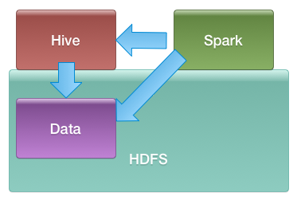

<link rel='stylesheet' href='../assets/css/main.css'/>

# Spark and Hive

## Overview

Access Hive tables from Spark



## Duration

20 minutes

## Step-1: Log into the Hadoop Cluster

Follow the instructions provided to log into the hadoop cluster

## Step-2: Stage Data in HDFS

For this we will use our data generator

**Get the labs if you haven't got them yet**

```bash
$   cd
$   git clone https://github.com/elephantscale/data-pipelining-with-spark-labs-101
```

For the rest of the labs, we assume the code is in `~/data-pipelining-with-spark-labs-101`

**Inspect the file** : `data-pipelining-with-spark-labs-101/03-data-generator/datagen-tx-large.scala`

**Note:** We are assuming that you are logged in as user **root** for the labs.  Adjust accordingly.

**Create a data directory in HDFS**

**ProTip**:

Here `sudo -u hdfs` means you are executing the rest of the command as user `hdfs`.  hdfs user is a super user in Hadoop

```bash
$   sudo -u hdfs    hdfs dfs -mkdir -p /data/transactions/csv

#  expand permissions
$   sudo -u hdfs    hdfs  dfs  -chmod  -R 777  /data
```

**Shape the data**

Our csv file has a header row.  Let's remove that as follows

```bash
# skip the header row
$   tail -n +2  \
        ~/data-pipelining-with-spark-labs-101/data/transactions/transactions-sample2.csv    \
        >   ~/data-pipelining-with-spark-labs-101/data/transactions/transactions-sample2-no-header.csv
```

**Copy the data from local file system to HDFS**

```bash
$   hdfs  dfs -put   \
        ~/data-pipelining-with-spark-labs-101/data/transactions/transactions-sample2-no-header.csv  \
        /data/transactions/csv/

# expand permissions again
$   sudo -u hdfs    hdfs  dfs  -chmod  -R 777  /data
```

**Check the data is in HDFS**

```bash
$   hdfs dfs -ls -R  /data/transactions/
```

You might see outputlike this:

```console
transactions-sample-no-header.csv
```

## Step-3: Create a Hive Table

Use hive shell...

```bash
$   hive
```

And in Hive shell, try the following comamnds to see databases and tables

```sql
hive>  show databases;

-- use default db
hive>  use default;

hive> show tables;
```

Here we are going to create a `transactions` table as follows:

```sql
hive>

 CREATE EXTERNAL TABLE transactions (
            `id` STRING,
            `timestamp` TIMESTAMP,
            `mti` STRING,
            `card_number` STRING,
            `amount_customer` DECIMAL(10,2),
            `merchant_type` INT,
            `merchant_id` STRING ,
            `merchant_address` STRING,
            `ref_id`  STRING, 
            `amount_merchant`  DECIMAL (10,2),
            `response_code` INT
            )
        ROW FORMAT DELIMITED
        FIELDS TERMINATED BY '|'
        stored as textfile
        LOCATION '/data/transactions/csv'  ;
```

Once the table is created, try the following queries

```sql
hive>
        show tables;

        select * from transactions limit 10;  -- do not forget limit!

        select id, ref_id  from transactions limit 10;

```

**Let's try a sample query**

```sql
hive> 
    select AVG(amount_customer) from transactions;
```

## Step-4: Now launch Spark Shell

```bash
$   spark-shell --master yarn
```

When the shell launches, you will see messages that it is connected to Hive.

Specifying a custom port

```bash
    $   spark-shell  --conf spark.ui.port=4060
```

Turn off UI altogether  

```bash
    $   spark-shell  --conf spark.ui.enabled=false
```

Turn off logs

```python
    sc.setLogLevel("WARN")
```

## Step-5: Access Hive Metadata

From within Spark-shell, try these commands

```python

from pprint import pprint

pprint(spark.catalog.listDatabases())

## list tables in 'default' database
pprint(spark.catalog.listTables("default"))

## TODO: Try another db
pprint(spark.catalog.listTables("db1"))

```

## Step-6: Query Hive Table from Spark

Execute the following commands from within PySpark shell

```python
# access 'transactions' table from hive
spark.sql ("select * from transactions").show()

spark.sql ("select AVG(amount_customer) from transactions").show()
```

## Takeaways

In this lab, you have verified Hive access from Spark
