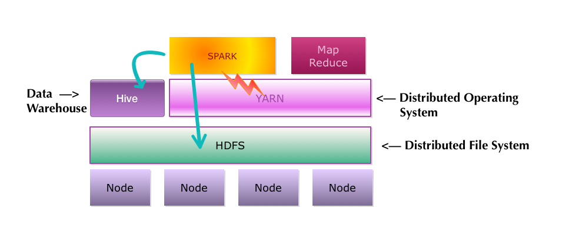

<link rel='stylesheet' href='../assets/css/main.css'/>

# Spark and Hive Labs

## Introduction

Spark works well with Hive.

Spark can query Hive to get _meta information_ (schema ..etc).  And Spark can access data in HDFS.

## Lab-6.1: Accessing Hive datastore from Spark

- Query Hive to see what databases and tables are defined

[Lab 6.1 instructions](6-1_hive-spark.md)

## Lab-6.2: Querying Hive table from Spark

- Run a SQL queries on Hive table data

[Lab 6.2 instructions](6-2_hive-spark-2.md)
