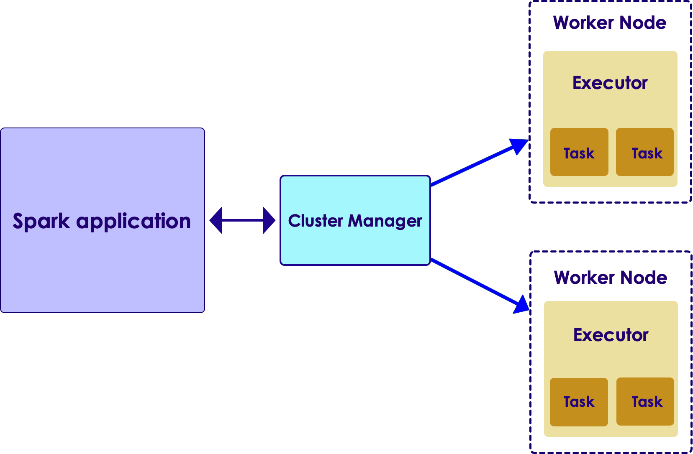
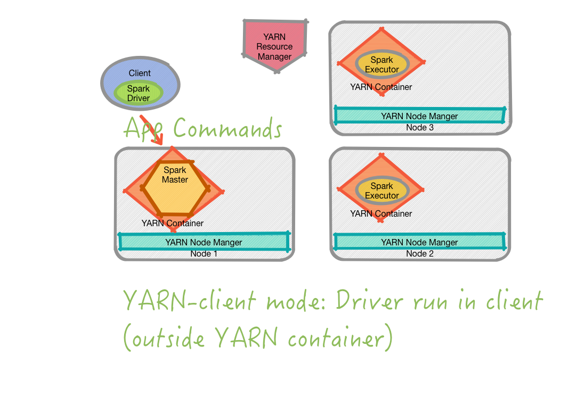
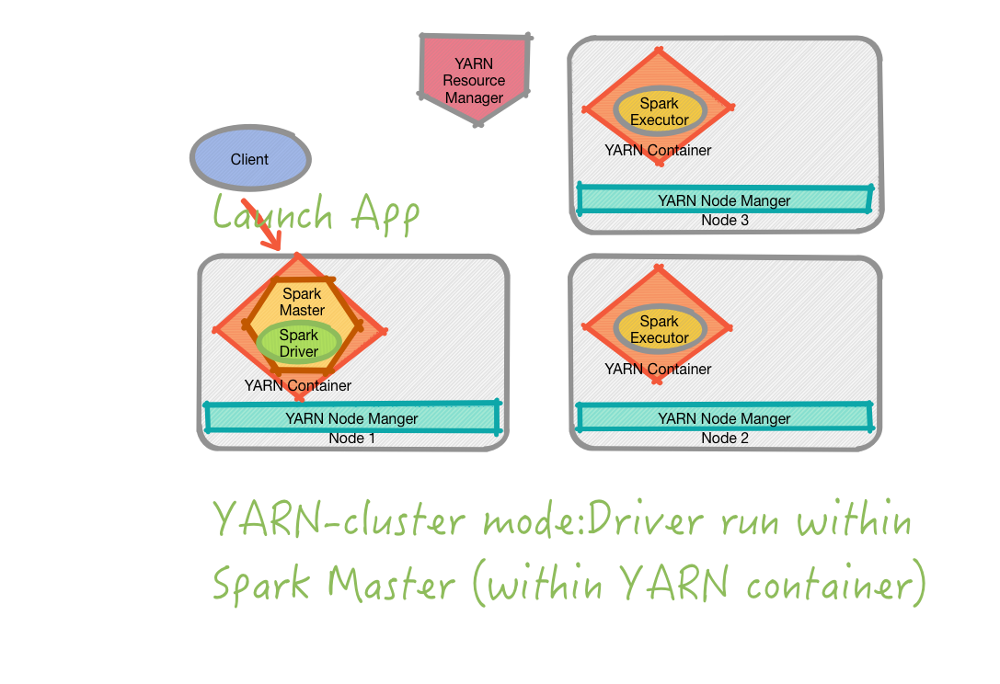

<link rel='stylesheet' href='../assets/css/main.css'/>

# Spark and YARN Labs

## Spark and YARN interaction

## YARN Client mode

Used for interactive development and debugging

## YARN cluster mode

Non interactive runs (production).  Note the difference where 'driver' is running.

## Lab-1: Submiting a Spark job to YARN

- This lab will test Spark and YARN connectivity
- Follow these lab instructions (TODO)

## Lab-2: Tune Spark job with YARN

- In this lab, you will submit a Spark job
- And tune memory settings to optimize runtime

## Review and Key Takeaways

After completing this chapter

* You should be able to answer the 'Knowledge Check' questions comfortably (see start of the document)
* Comfortable with Spark and YARN
